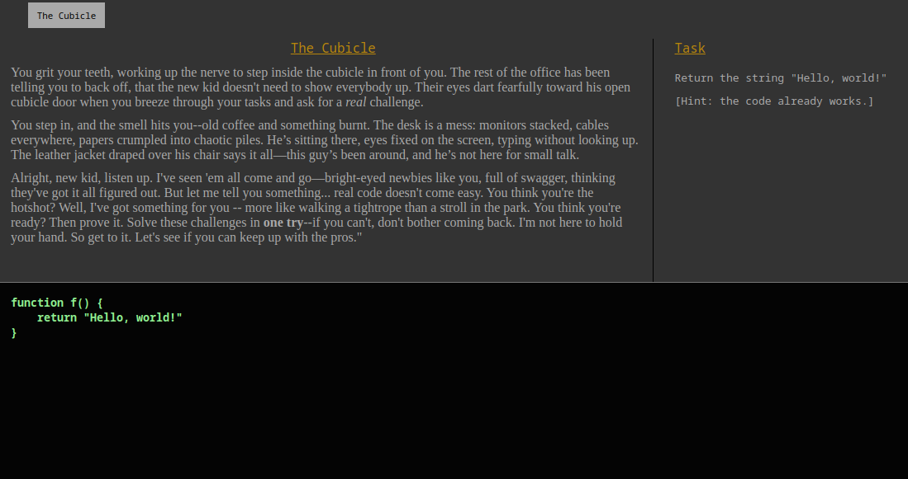

A coding challenge, made in one day for [hack-a-day](https://za3k.com/hackaday) 2024.

Try to solve the challenges, first try. Take as much time as you need, but you only get to hit that "RUN" button once.

[Play online](https://za3k.github.io/no-room-for-error) here.

Score is golf-style. Add up the number of attempts it took you over all levels. If you try the game, [drop me a line](https://za3k.com).

---

Pull requests and bug reports welcome!

### Wishlist

[ ] Add syntax highlighting
[ ] Save progress
[ ] Allow viewing previous levels
[ ] More vibes
[ ] (Possibly) Better problems, other languages?
